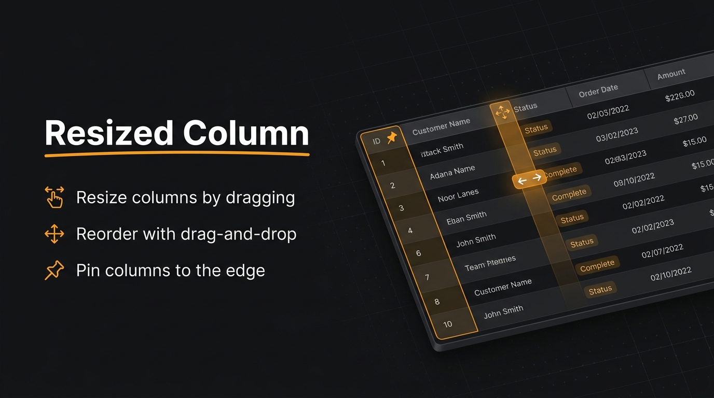

# asmit/resized-column



Resizable, reorderable, and pinnable table columns for Filament. Users drag column edges to resize, drag headers to reorder, and pin columns to the left — every choice persisted per user in the session, the database, or both.

[](https://packagist.org/packages/asmit/resized-column)
[](https://packagist.org/packages/asmit/resized-column)
[](https://filamentphp.com)
[](LICENSE.txt)

## Features

- **Drag-to-resize** — grab any column edge; widths persist per user
- **Drag-to-reorder** *(beta)* — `->dragReorderableColumns()` puts a grip on each header
- **Pinned columns** *(beta)* — `->sticky()` for developer defaults, `->stickableColumns()` for a user-facing "Pin columns" panel with draft + Apply
- **Persistence** — session by default, database opt-in; widths, order, and pins share one settings row per user
- **Works without a panel** — the same trait drives tables in plain Livewire components
- **Filament-native styling** — pinned cells match Filament's own table surfaces in light and dark, and stay opaque while scrolling
- **Customisable trigger** *(beta)* — restyle the toolbar button via `->stickyManagerTriggerAction()`

## Beta features

Column **reordering** and **sticky (pinned) columns** ship in the `4.0.0-beta.*` releases. They work, but the behaviour and API may still change before the stable 4.0 release — pin an exact version if you need stability:

```bash
composer require asmit/resized-column:4.0.0-beta.5
```

Column resizing and the storage layer are stable.

## Requirements

- Filament 3, 4, or 5

## Installation

```bash
composer require asmit/resized-column
npm --prefix vendor/asmit/resized-column run build
php artisan filament:assets
```

When developing the package from source (path repo), run `npm run build` inside the package directory whenever you change `resources/css/` or `resources/js/`, then `php artisan filament:assets` in the host app.

Register the plugin in your panel provider:

```php
use Asmit\ResizedColumn\ResizedColumnPlugin;

public function panel(Panel $panel): Panel
{
    return $panel
        ->plugins([
            ResizedColumnPlugin::make()
                ->preserveOnDB(), // optional — database persistence
        ]);
}
```

Database persistence also needs the settings table:

```bash
php artisan vendor:publish --provider="Asmit\ResizedColumn\ResizedColumnServiceProvider" --tag=resized-column-migrations
php artisan migrate
```

## Usage

Add the trait to any list page or Livewire component that renders a table:

```php
use Asmit\ResizedColumn\HasResizableColumn;

class ListUsers extends ListRecords
{
    use HasResizableColumn;

    protected static string $resource = UserResource::class;
}
```

Opt into reordering and pinning per table:

```php
public function table(Table $table): Table
{
    return $table
        ->columns([
            TextColumn::make('name')->sticky(), // pinned by default
            TextColumn::make('email'),
            TextColumn::make('created_at'),
        ])
        ->dragReorderableColumns()
        ->stickableColumns();
}
```

**[View Complete Documentation →](https://asmitnepali.github.io/resized-column/)**

## Credits

- [Asmit Nepal][link-asmit]
- [Kishan Sunar][link-kishan]

## Contributing

Contributions are welcome. Please see [CONTRIBUTING.md](CONTRIBUTING.md) before opening an issue or pull request.

## Security

If you discover a security issue, please e-mail asmitnepali99@gmail.com instead of opening a public issue. All reports are addressed promptly.

## Changelog

Please see [Releases](https://github.com/AsmitNepali/resized-column/releases) for recent changes.

## License

MIT License. See [LICENSE.txt](LICENSE.txt) for details.

[link-asmit]: https://github.com/AsmitNepali
[link-kishan]: https://github.com/Kishan-Sunar
